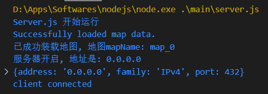
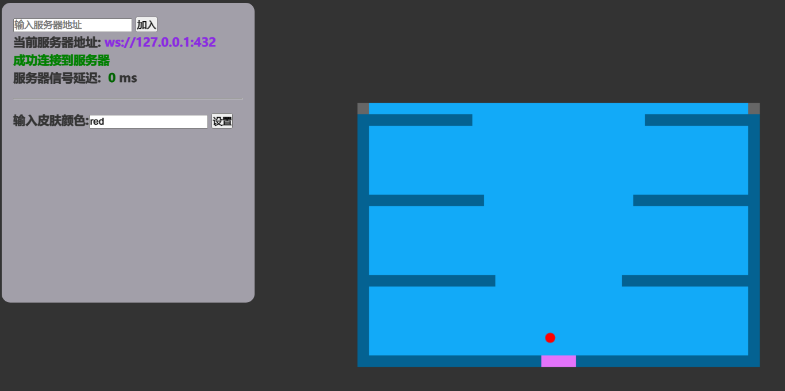

# Jumpin-Ball 多人模式
横版跳跃游戏现已推出**多人模式**! 当前处于**Alpha**阶段, 请多提建议.
项目投入时间: [](https://wakatime.com/badge/user/a08db52b-db5f-48ec-9b55-6d1f4a5ffea2/project/018c0f0a-d018-4edd-ae30-b03cb135902a)

# 使用说明
## 服务端
需要安装`Node.js`   
运行`main/server.js`即可  
之后会在`432`端口开启`websocket`服务器, 请确保该端口没有被占用



## 客户端
由于`cross-origin`问题, 客户要`fetch` `map.json`文件, 必须要有本地服务器  
因此采用python临时搭建小服务器提供文件传输服务, 请确保安装`Python3`   
之后运行`main/client.bat`即可, 会自动打开客户端服务器*8088端口*和游戏网页

> 服务器地址填主机的ip地址

# TODO清单
 + [x] 原本游戏中的特殊砖块*script*实现
 + [x] 各个玩家的死亡判定, 死亡计次的现实, 玩家退出的时候服务器删除ta的存在
 + [ ] 客户端玩家面板的完善(死亡计次, 当前数值, 武器, 技能, 效果*buff*)
 + [ ] 战斗的方式(子弹, 近战)
 + [x] 玩家名称, 血条头顶显示
 + [x] 光圈标记或是移动时的特效等的实现
 + [x] 玩家的死亡动画以及复活方式(死亡后的倒计时)
 + [ ] 各种武器, 技能的实现
 + [ ] 野怪, NPC机器人的设置
 + [x] 地图的改变, 在背景显示地图名称
 + [ ] 转场特效
 + [ ] 背景音乐, 音效, 按键音的设置
 + [ ] 登陆界面, 角色选择 

# 新的游戏设想
以**酒馆机制**为框架, 实现一个多人大乱斗的游戏

## 概述
备战环节, 每位玩家可以通过商店获取道具, 并可以调配自己的装备(饰品等)  
进入战斗阶段后, 会在地图上随机出现各种道具(或者材料/资源), 玩家自发进行抢夺, 形成混战   
战斗阶段分为两个阶段, 白昼与黑夜, 因此玩家需要准备两套装备, 战斗风格也会因此而改变

## 游戏设定 
### 胜利/存活条件
血量为0的玩家会被淘汰, 最后存活的玩家获得胜利   
为避免死亡后失去游戏参与感, 死亡的玩家将化为鬼魂(借鉴游戏: ***crawl***)   
鬼魂通过操作地图上的机关来干扰存货玩家, 如果造成伤害将会获得奖励, 有概率复活, 以此增强游戏性  
如果仅一位玩家幸存, 游戏结束  
考虑到鬼魂不断生成游戏无法结束的情况, 只允许鬼魂在晚上出现, 这样白天只有最后一个幸存者, 游戏结束  

### 装备/饰品
全游戏画风统一为扑克牌, 道具也以扑克牌的形式呈现, 分为黑桃, 红桃, 方片, 梅花四个花色
 + **黑桃**: 攻击类武器, 如: 宝剑 / 长枪 / 锤子 / 弓箭 ...
 + **方片**: 防具, 如: 盾牌 / 铠甲 / 靴子 / 头盔 ...
 + **红桃**: 主动道具, 如: 治疗药剂 / 护盾 / 药膏 ...
 + **梅花**: 被动道具, 如: 生命值加成 / 攻击力加成 / 防御力加成 / 移动速度加成 ...

部分道具还有黑白之分, 限定在白昼或黑夜才能使用  
玩家可以拆散道具来获得点数, 以购买自己需要的道具
商店中随机出现道具, 价格也随机(考虑每轮备战环节提供5张牌)  
商店暂时不设置等级(tier)机制, 后续考虑升级的好处  

玩家身上只能携带各个花色各一个, 但是要准备两套装备, 一套用于白天, 一套用于黑夜  

# 代码细节
## 玩家对象
```JavaScript
playerDic[ip] = {
  key: {控制按键情况},
  chara: {角色对象},
  info: {玩家信息},
  ws: ws
}
```

## 玩家信息
```JavaScript
info = {
  name: "",
  colour: "#000",
}
```

## 角色对象
```JavaScript
chara = {
  loc: {x: 0, y: 0},    // 实际坐标
  vel: {x: 0, y: 0},    // 移动速度
  
  name: "defaultPlayer",
  colour: '#000',
  current_mapId: 0,
  
  can_jump: true,
  doublejumpFlag: false,
  can_doublejump: true,
  can_dash: true,
  doublejump_ability: true,
  glide_ability: true,
  dash_ability: true,
  float_ability: true,

  buff: [{buff效果}],
  equipment: {
    club: item,
    heart: item,
    spade: item,
    diamond: item,
  },

  state: {
    hp: 30,
    mp: 10,
    hp_max: 30,
    mp_max: 10,
    money: 0,
  },


}
```

## 物品对象
```JavaScript
item = {
  name: "",
  type: ENUM, // ITEM_TYPE_SPADE, ITEM_TYPE_CLUB, ITEM_TYPE_HEART, ITEM_TYPE_DIAMOND
  class: ENUM, // ITEM_CLASS_WHITE, ITEM_CLASS_BLACK
  // colour: "#000",
  info: "效果说明",
  id: 0,
  tier: 0,
  price: 0,
}
```

## Buff对象
```JavaScript
```

## 通信信息
### 客户端向服务器发送的信息
```JavaScript
{
  key: {控制按键情况},
  name: "",
  color: "#000",

}
```

### 服务器向客户端发送的信息
```JavaScript
{
  map_id: 1,
  players: Object.values(playerDic).map((player) => player.chara),
  yourIndex: {接收者的序号},
  time: new Date().getTime()
}
```

# 开发中遇到的问题
## 地图对象
地图信息由较小的map.json文件提供, 在实际游戏中会被转化成较大的map对象(每个砖块都会由一个数字转化为一个对象), 这会造成大量的内存占用  
为了实现一些特殊效果, 我期望在服务器修改砖块属性, 能够影响到所有的客户端  
如果传递地图对象, 会导致大量的数据传输, 造成不必要的性能占用  
> 当前想法是增量传输, 兼容性较好吧, 可以实现任意效果
每张图的砖块信息分为两种:
  + 表层: 贴图 颜色 形状
  + 底层: 物理属性 弹性 摩擦力
客户端看表层, 服务器看底层   
如果要发生变化, 服务器就发送一个增量修改数组, 指出哪些坐标对应的砖块的新属性是什么  
也就是原地图画在*后面的图层*, 新的修改数组画在*前面的图层*

## 视图转换
游戏中一共涉及到**4**个坐标系:
 + **原始数组坐标系**: 数组形式存储的地图信息, 是以0开始的二维数组下标
 + **数据坐标系**: 将原始数据乘上砖块的大小, 得到的**静态坐标系**
 + **canvas坐标系**: 按照相机渲染出的canvas上的坐标系
 + **html坐标系**: 实际html中窗口的坐标系

他们之间的转换关系如下:
 + **原始数组坐标系**  乘上 `tilesize` -> **数据坐标系**
 + **数据坐标系**  减去 `camera` -> **canvas坐标系**
 + **canvas坐标系**  乘上 `zoomIndex` -> **html坐标系**

> 最重要的是**数据坐标系**, 静态且绝对

其中`camera`基本跟踪玩家的静态坐标, 但是为了动态效果会有插值, 因此**canvas坐标系**是相对动态的   
函数调用中:
 1. 存储下的坐标都是**数据坐标系**
 2. 绘制的坐标都是**canvas坐标系**